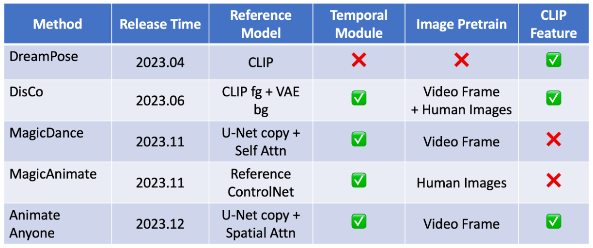
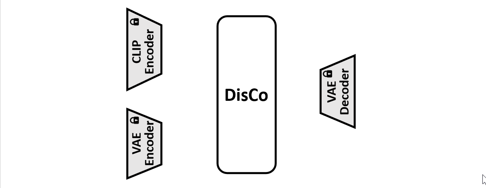

# DisCo: Disentangled Control for Realistic Human Dance Generation

<a href='https://disco-dance.github.io/'></a> <a href='https://arxiv.org/abs/2307.00040'></a> <a href='https://b9652ca65fb3fab63a.gradio.live/'></a> [](https://colab.research.google.com/drive/1dErsSwSEdcAyP6V_mqayW0qdPuoHSz-j?usp=sharing) [](https://youtu.be/D_mPPjUCDjE) <a href='https://drive.google.com/file/d/1AlN3Thg46RlH5uhLK-ZAIivo-C8IJeif/view?usp=sharing/'></a>

[Tan Wang*](https://wangt-cn.github.io/),  [Linjie Li*](https://scholar.google.com/citations?user=WR875gYAAAAJ&hl=en),  [Kevin Lin*](https://scholar.google.com/citations?hl=en&user=LKSy1kwAAAAJ),  [Yuanhao Zhai](https://www.yhzhai.com/), [Chung-Ching Lin](https://scholar.google.com/citations?hl=en&user=legkbM0AAAAJ),  [Zhengyuan Yang](https://scholar.google.com/citations?hl=en&user=rP02ve8AAAAJ),  [Hanwang Zhang](https://scholar.google.com/citations?hl=en&user=YG0DFyYAAAAJ),  [Zicheng Liu](https://scholar.google.com/citations?hl=en&user=bkALdvsAAAAJ),  [Lijuan Wang](https://scholar.google.com/citations?hl=en&user=cDcWXuIAAAAJ)

**Nanyang Technological University  &nbsp; | &nbsp;  Microsoft Azure AI &nbsp; |&nbsp;  University at Buffalo**

[](https://youtu.be/D_mPPjUCDjE "DisCo: Disentangled Control for Referring Human Dance Generation in Real World")

<br><br/>

## :fire: News
* **[2023.12.30]** Update [slides](https://drive.google.com/file/d/1AlN3Thg46RlH5uhLK-ZAIivo-C8IJeif/view?usp=sharing) about introducing DisCo and summarizing recent works.
* **[2023.11.30]** Update DisCo w/ temporal module.
* **[2023.10.12]** Update the new ArXiv version of DisCo (Add temporal module; Synchronize FVD computation with MCVD; More baselines and visualizations, etc)
* **[2023.07.21]** Update the [construction guide](https://github.com/Wangt-CN/DisCo/blob/main/PREPRO.md) of the TSV file.
* **[2023.07.08]** Update the [Colab](https://colab.research.google.com/drive/1dErsSwSEdcAyP6V_mqayW0qdPuoHSz-j?usp=sharing) Demo (make sure our code/demo can be run on any machine)!
* **[2023.07.03]** Provide the local demo deployment [example code](https://github.com/Wangt-CN/DisCo#-demo). Now you can try our demo on you own dev machine!
* **[2023.07.03]** We update the Pre-training [tsv data](https://github.com/Wangt-CN/DisCo#1-human-attribute-pre-training).
* **[2023.06.28]** We have released DisCo Human Attribute Pre-training Code.
* **[2023.06.21]** DisCo Human Image Editing [Demo](https://b9652ca65fb3fab63a.gradio.live/) is released! Have a try!
* **[2023.06.21]** We release the human-specific fine-tuning [code](https://github.com/Wangt-CN/DisCo#human-specific-fine-tuning) for reference. Come and build your own specific dance model!
* **[2023.06.21]** Release the code for [general fine-tuning](https://github.com/Wangt-CN/DisCo#fine-tuning-with-disentangled-control).
* **[2023.06.21]** We release the human attribute pre-trained checkpoint and the fine-tuning checkpoint.


##### Other following projects you may find interesting:


* [Animate Anyone](https://arxiv.org/abs/2311.17117), from Alibaba
* [MagicAnimate](https://arxiv.org/abs/2311.16498), from TikTok
* [MagicDance](https://arxiv.org/abs/2311.12052), from TikTok


##### Comparison of recent works:
<p align="center">
  
</p>
<br><br/>

## 🎨 Gradio Demo 

#### Launch Demo Locally (Video dance generation demo is on the way!)

1. Download the fine-tuning checkpoint [model](https://entuedu-my.sharepoint.com/:f:/g/personal/tan317_e_ntu_edu_sg/EpEPp_6rFtFComv49I0bkKkBfqiJhFnbraiZSN0LjXpzHw) (our demo uses this [checkpoint](https://entuedu-my.sharepoint.com/:f:/g/personal/tan317_e_ntu_edu_sg/En3vpzKndr1OoBUoDhTCZvEBorQiXEhJzi6mYWNELVWnpg?e=AIrGlx), you can also use your own model); Download the [sd-image-variation](https://huggingface.co/lambdalabs/sd-image-variations-diffusers) via `git clone https://huggingface.co/lambdalabs/sd-image-variations-diffusers`.

2. Run the [jupyter notebook](https://github.com/Wangt-CN/DisCo/blob/main/human_img_edit_gradio.ipynb) file. All the required code/command are already set up. Remember to revise the pretrained model path `--pretrained_model` and `--pretrained_model_path (sd-va)` in `manual_args = [xxx]`.

3. After running, this jupyter will automatically launch the demo with your local dev GPU. You can visit the demo with the web link provided at the end of the notebook. 

4. Or you can refer to our deployment with Colab [](https://colab.research.google.com/drive/1dErsSwSEdcAyP6V_mqayW0qdPuoHSz-j?usp=sharing). All the code are deployed from scratch!

   <br><br/>

##### [[Online Gradio Demo]](https://b9652ca65fb3fab63a.gradio.live/) (Temporal)

<p align="center">
  
</p>


<br><br/>


## 📝 Introduction

In this project, we introduce **DisCo** as a generalized referring human dance generation toolkit, which supports both **human image & video generation** with **multiple usage cases** (pre-training, fine-tuning, and human-specific fine-tuning), especially good in real-world scenarios.


#### ✨Compared to existing works, DisCo achieves:

- **Generalizability** to a large-scale real-world human **without human-specific fine-tuning** (We also support [human-specific fine-tuning](https://github.com/Wangt-CN/DisCo#human-specific-fine-tuning)). Previous methods only support generation for a specific domain of human, e.g., [DreamPose](https://github.com/johannakarras/DreamPose) only generate fashion model with easy catwalk pose.

- Current **SOTA results** for referring human dance generation.

- Extensive usage cases and applications (see [project page](https://disco-dance.github.io/index.html) for more details). 

- An easy-to-follow framework, supporting **efficient training** (x-formers, FP16 training, deepspeed, wandb) and **a wide range of possible research directions** (pre-training -> fine-tuning -> human-specific fine-tuning).

  

#### 🌟With this project, you can get:

- *\[User\]*: Just try our online demo! Or deploy the model inference locally. 
- *\[Researcher\]*: An easy-to-use codebase for re-implementation and development.
- *\[Researcher\]*: A large amount of research directions for further improvement.


<br><br/>

## 🚀 Getting Started

### Installation

```sh
## after py3.8 env initialization
pip install --user torch==1.12.1+cu113 torchvision==0.13.1+cu113 -f https://download.pytorch.org/whl/torch_stable.html
pip install --user progressbar psutil pymongo simplejson yacs boto3 pyyaml ete3 easydict deprecated future django orderedset python-magic datasets h5py omegaconf einops ipdb
pip install --user --exists-action w -r requirements.txt
pip install git+https://github.com/microsoft/azfuse.git


## for acceleration
pip install --user deepspeed==0.6.3
pip install -v -U git+https://github.com/facebookresearch/xformers.git@main#egg=xformers

## you may need to downgrade prototbuf to 3.20.x
pip install protobuf==3.20.0
```


### Data Preparation

##### 1. Human Attribute Pre-training

We create a human image subset (700K Images) filtered from existing image corpus for human attribute pre-training:

| Dataset  | COCO (Single Person) | TikTok Style | DeepFashion2 | SHHQ-1.0 | LAION-Human |
| -------- | :------------------: | :----------: | :----------: | :------: | :---------: |
| **Size** |         20K          |     124K     |     276K     |   40K    |    240K     |

The pre-processed pre-training data with the efficient TSV data format can be downloaded [**here (Google Drive)**](https://drive.google.com/file/d/1N9gioWnkb3ZZytmT3Nzx4VjXjHxLsVB9/view?usp=sharing).

```
Data Root
└── composite/
    ├── train_xxx.yaml  # The path need to be then specified in the training args
    └── val_xxx.yaml
    ...
└── TikTokDance/
    ├── xxx_images.tsv
    └── xxx_poses.tsv
    ...
└── coco/  
    ├── xxx_images.tsv
    └── xxx_poses.tsv
```


##### 2. Fine-tuning with Disentangled Control

We use the [TikTok dataset](https://www.yasamin.page/hdnet_tiktok) for the fine-tuning. 

We have already pre-processed the tiktok data with the efficient TSV format which can be downloaded **[here (Google Drive)](https://drive.google.com/file/d/1_b4naNB1QozGL-tKyHwSSYzTw8RIh5z3/view?usp=sharing)**. (Note that we only use the 1st frame of each TikTok video as the reference image.)

The data folder structure should be like:

```
Data Root
└── composite_offset/
    ├── train_xxx.yaml  # The path need to be then specified in the training args
    └── val_xxx.yaml
    ...
└── TikTokDance/
    ├── xxx_images.tsv
    └── xxx_poses.tsv
    ...
```

*PS: If you want to use your own data resource but with our TSV data structure, please follow [PREPRO.MD](https://github.com/Wangt-CN/DisCo/blob/main/PREPRO.md) for reference. 

<br><br/>


### Human Attribute Pre-training

<p align="center">
  
</p>


**Training:**

```
AZFUSE_USE_FUSE=0 QD_USE_LINEIDX_8B=0 NCCL_ASYNC_ERROR_HANDLING=0 python finetune_sdm_yaml.py --cf config/ref_attn_clip_combine_controlnet_attr_pretraining/coco_S256_xformers_tsv_strongrand.py --do_train --root_dir /home1/wangtan/code/ms_internship2/github_repo/run_test \
--local_train_batch_size 64 --local_eval_batch_size 64 --log_dir exp/tiktok_pretrain \
--epochs 40 --deepspeed --eval_step 2000 --save_step 2000 --gradient_accumulate_steps 1 \
--learning_rate 1e-3 --fix_dist_seed --loss_target "noise" \
--train_yaml ./blob_dir/debug_output/video_sythesis/dataset/composite/train_TiktokDance-coco-single_person-Lindsey_0411_youtube-SHHQ-1.0-deepfashion2-laion_human-masks-single_cap.yaml --val_yaml ./blob_dir/debug_output/video_sythesis/dataset/composite/val_TiktokDance-coco-single_person-SHHQ-1.0-masks-single_cap.yaml \
--unet_unfreeze_type "transblocks" --refer_sdvae --ref_null_caption False --combine_clip_local --combine_use_mask \
--conds "masks" --max_eval_samples 2000 --strong_aug_stage1 --node_split_sampler 0
```


**Pre-trained Model Checkpoint: [OneDrive](https://entuedu-my.sharepoint.com/:f:/g/personal/tan317_e_ntu_edu_sg/EoH8KHplKPhGrIdKN6sPx_ABpurpPjNAvU3KdFgaPwNfJQ)**

<br><br/>


### Fine-tuning with Disentangled Control 


<br><br/>

#### 1. Modify the config file

Download the `sd-image-variations-diffusers` from official [diffusers repo](https://huggingface.co/lambdalabs/sd-image-variations-diffusers) and put it according to the config file `pretrained_model_path`. Or you can also choose to modify the `pretrained_model_path`.


<br><br/>
#### 2. w/o Classifier-Free Guidance (CFG)

**Training:**

[*To enable WANDB, set up the wandb key in `utils/lib.py`]

[*To employ **multiple GPU running**, try to add `mpirun -np {GPU NUM}` before the `python`.]

```shell
AZFUSE_USE_FUSE=0 NCCL_ASYNC_ERROR_HANDLING=0 python finetune_sdm_yaml.py --cf config/ref_attn_clip_combine_controlnet/tiktok_S256L16_xformers_tsv.py \
--do_train --root_dir /home1/wangtan/code/ms_internship2/github_repo/run_test \
--local_train_batch_size 32 \
--local_eval_batch_size 32 \
--log_dir exp/tiktok_ft \
--epochs 20 --deepspeed \
--eval_step 500 --save_step 500 \
--gradient_accumulate_steps 1 \
--learning_rate 2e-4 --fix_dist_seed --loss_target "noise" \
--train_yaml /home/wangtan/data/disco/yaml_file/train_TiktokDance-poses-masks.yaml \
--val_yaml /home/wangtan/data/disco/yaml_file/new10val_TiktokDance-poses-masks.yaml \
--unet_unfreeze_type "all" \
--refer_sdvae \
--ref_null_caption False \
--combine_clip_local --combine_use_mask \
--conds "poses" "masks" \
--stage1_pretrain_path /path/to/pretrained_model_checkpoint/mp_rank_00_model_states.pt 
```


**Visualization:**

To run the visualization, just change `--do_train` to `--eval_visu` . You can also specify the visualization folder name with `'--eval_save_filename' xxx`.


**Evaluation:**

You first need to run the evaluation to get the results. Then we use `gen_eval.sh` to one-stop get the evaluation metrics for {exp_dir_path}/{prediction_folder_name}

```shell
bash gen_eval.sh {exp_dir_path} {exp_dir_path}/{prediction_folder_name}
```
For example, 
```
bash gen_eval.sh /home/kevintw/code/disco/github2/DisCo/save_results/TikTok_cfg_check /home/kevintw/code/disco/github2/DisCo/save_results/TikTok_cfg_check/pred_gs1.5_scale-cond1.0-ref1.0/
```

You may need to download the [pre-trained vision model](https://drive.google.com/file/d/1J8w3fGj6H6kmcW9G8Ff6tRQofblaG5Vn/view?usp=sharing) and revise the path in `gen_eval.sh` for achieving fvd metric.

##### Model Checkpoint (OneDrive): [TikTok Training Data](https://entuedu-my.sharepoint.com/:f:/g/personal/tan317_e_ntu_edu_sg/Em8tYZ_J_51On_cMQDtOpqoBRG9H3tZNd2Mm48DFh3sypA?e=cyBgJQ) | [More TikTok-Style Training Data](https://entuedu-my.sharepoint.com/:f:/g/personal/tan317_e_ntu_edu_sg/En3vpzKndr1OoBUoDhTCZvEBorQiXEhJzi6mYWNELVWnpg?e=AIrGlx)


<br><br/>

#### 3. w/ Classifier-Free Guidance (CFG) [CFG can bring a slightly better results]

**Training (add the following args into the training script of w/o CFG):**

```
--drop_ref 0.05 # probability to dropout the reference image during training
--guidance_scale 1.5 # the scale of the CFG
```

**Visualization:**

To run the visualization, just change `--do_train` to `--eval_visu` . You can also specify the visualization folder name with `'--eval_save_filename' xxx`. (Remember to also specify the `--guidance_scale`)

You can also check our command bash file `config/command_bash/tiktok_cfg.sh` for reference.


**Evaluation:**

Same with above


##### Model Checkpoint (OneDrive): [TikTok Training Data](https://entuedu-my.sharepoint.com/:f:/g/personal/tan317_e_ntu_edu_sg/EpJSOWGzrnlNn99nC691G8wBF-JnbuYCbgbHMRg6TQFAxg?e=QUJJOL) | [More TikTok-Style Training Data](https://entuedu-my.sharepoint.com/:f:/g/personal/tan317_e_ntu_edu_sg/EiDYzx84T8pMhrDtcoIU5w0By9ysDotKzmezShKkX8aE4g?e=zzLuEA)

#### 4. Temporal module fine-tuning
**Training:**
After training the image DisCo model, we further incorporate temporal convolutional layers and temporal attention layers to improve the temporal smoothness. Note that the content for argument `--pretrained_model` should be the image DisCo model checkpoint, instead of stage 1 pre-trained checkpoint.
```shell
AZFUSE_USE_FUSE=0 NCCL_ASYNC_ERROR_HANDLING=0 python finetune_sdm_yaml.py --cf config/disco_w_tm/yz_tiktok_S256L16_xformers_tsv_temdisco_temp_attn.py \
--do_train --root_dir /home1/wangtan/code/ms_internship2/github_repo/run_test \
--local_train_batch_size 2 \
--local_eval_batch_size 2 \
--log_dir exp/tiktok_ft \
--epochs 20 --deepspeed \
--eval_step 500 --save_step 500 \
--gradient_accumulate_steps 1 \
--learning_rate 1e-4 --fix_dist_seed --loss_target "noise" \
--train_yaml /home/wangtan/data/disco/yaml_file/train_TiktokDance-poses-masks.yaml \
--val_yaml /home/wangtan/data/disco/yaml_file/new10val_TiktokDance-poses-masks.yaml \
--unet_unfreeze_type "all" \
--refer_sdvae \
--ref_null_caption False \
--combine_clip_local --combine_use_mask \
--train_sample_interval 4 \
--nframe 16 \
--frame_interval 1 \
--conds "poses" "masks" \
--pretrained_model /path/to/pretrained_model/mp_rank_00_model_states.pt 
```

**Evaluation:**
Simply replace the previous `gen_eval.sh` script with the `gen_eval_tm.sh` script, as follows.

```shell
bash gen_eval_tm.sh {exp_dir_path} {exp_dir_path}/{prediction_folder_name}
```

##### Model checkpoint (coming very soon): TikTok training data (w/o CFG) | TikTok training data (w/ CFG) | More TikTok-Style Training Data (w/ CFG)

<br><br/>

#### 5. Possible issue for FVD metric reproduction

Please first check the github issue and response [here](https://github.com/Wangt-CN/DisCo/issues/25#issuecomment-1716394151). We have validated the checkpoint results on A100 GPU. If you still cannot reproduce the results, please open an issue or send me the email.

<br><br/>

### Human-Specific Fine-tuning


#### 1. Prepare dataset that you want to use for training

- Prepare a human-specific video or a set of human images

- Use Grounded-SAM and OpenPose to obtain human mask and human skeleton for each training image (See [PREPRO.MD](https://github.com/Wangt-CN/DisCo/blob/main/PREPRO.md) for more details)

- For human-specific fine-tuning, we recommend to directly use raw image/mask/pose for training rather than build TSV file. If you still want to use TSV file structure to prepare your data,  please follow [PREPRO.MD](https://github.com/Wangt-CN/DisCo/blob/main/PREPRO.md) for reference.

  

#### 2. Run the following script for human-specific fine-tuning:

For parameter tuning, recommend to first tune the `learning-rate` and `unet_unfreeze_type`.

```python
AZFUSE_USE_FUSE=0 NCCL_ASYNC_ERROR_HANDLING=0 python finetune_sdm_yaml.py \
--cf config/ref_attn_clip_combine_controlnet_imgspecific_ft/webtan_S256L16_xformers_upsquare.py --do_train --root_dir /path/of/saving/root \
--local_train_batch_size 32 --local_eval_batch_size 32 --log_dir exp/human_specific_ft/ \
--epochs 20 --deepspeed --eval_step 500 --save_step 500 --gradient_accumulate_steps 1 \
--learning_rate 1e-3  --fix_dist_seed  --loss_target "noise" \
--unet_unfreeze_type "crossattn" \
--refer_sdvae --ref_null_caption False --combine_clip_local --combine_use_mask --conds "poses" "masks" \
--freeze_pose True --freeze_background False \
--pretrained_model /path/to/the/ft_model_checkpoint \
--ft_iters 500 --ft_one_ref_image False --ft_idx dataset/folder/name --strong_aug_stage1 True --strong_rand_stage2 True
```


<br><br/>

## Release Plan

- [x] Code for "Fine-tuning with Disentangled Control"
- [x] Code for "Human-Specific Fine-tuning"
- [x] Model Checkpoints for Pre-training and Fine-tuning
- [x] HuggingFace Demo
- [x] Code for "Human Attribute Pre-training"


<br><br/>

## Citation	

If you use our work in your research, please cite: 

```
@article{wang2023disco,
  title={Disco: Disentangled control for referring human dance generation in real world},
  author={Wang, Tan and Li, Linjie and Lin, Kevin and Zhai, Yuanhao and Lin, Chung-Ching and Yang, Zhengyuan and Zhang, Hanwang and Liu, Zicheng and Wang, Lijuan},
  journal={arXiv preprint arXiv:2307.00040},
  website={https://disco-dance.github.io/},
  year={2023}
}
```

